# Lumisound screenshots

From [this run](https://github.com/HeavenlyXenusVR/Lumisound/actions/runs/36522201104) on `claude/albums-now-playing-redesign-rm1mcd` at `a20e76f`. Replaced on every run.

## iphone-17-dark

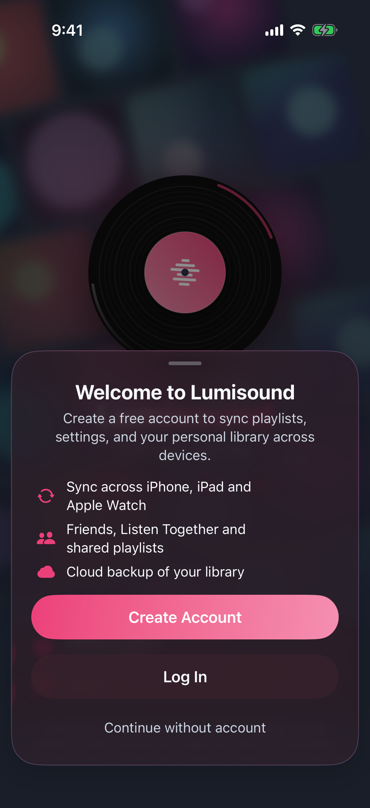
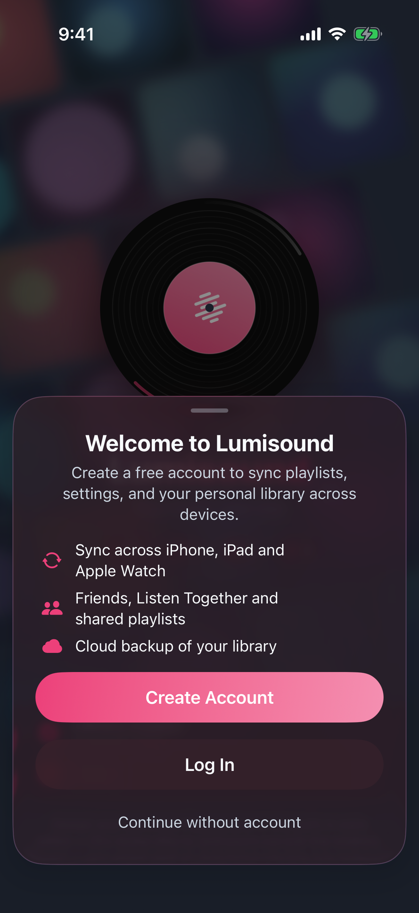
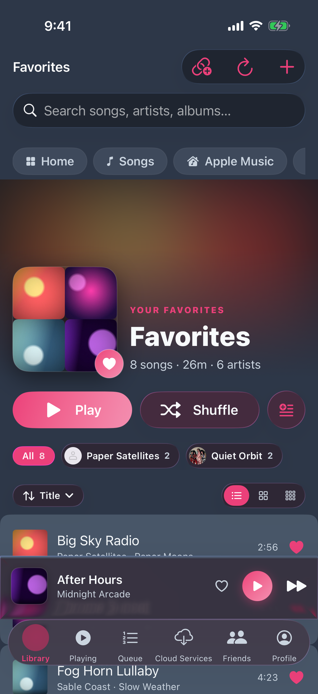
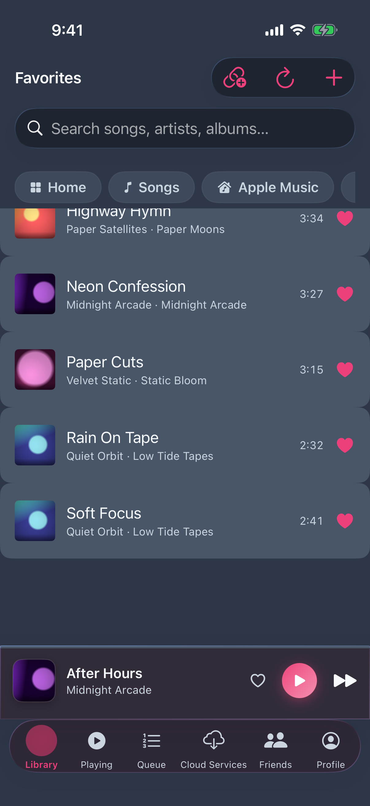
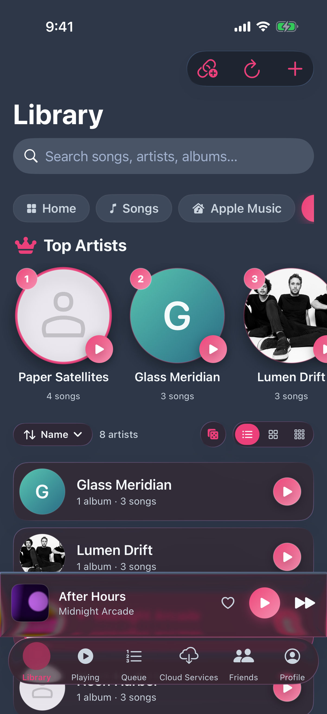
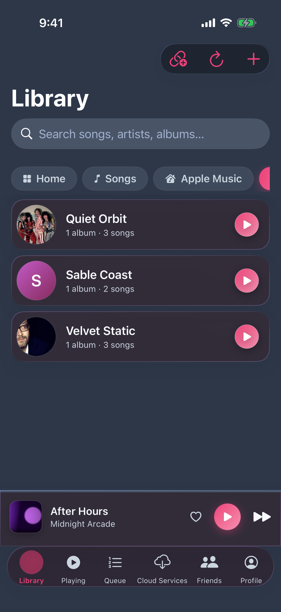
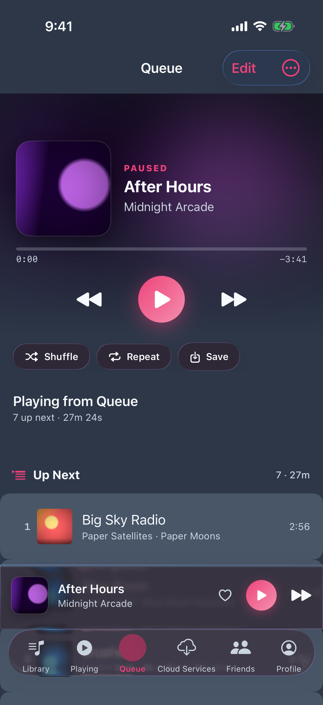
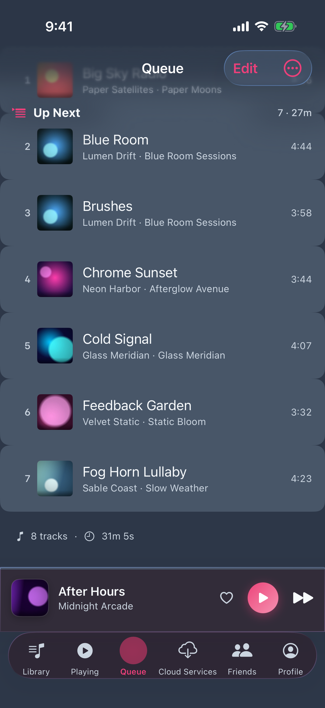

## iphone-17-pro-max-dark

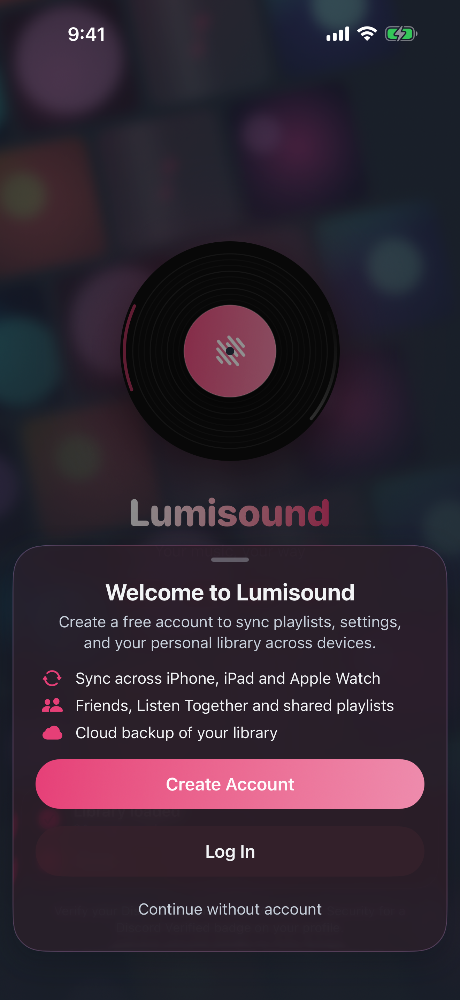
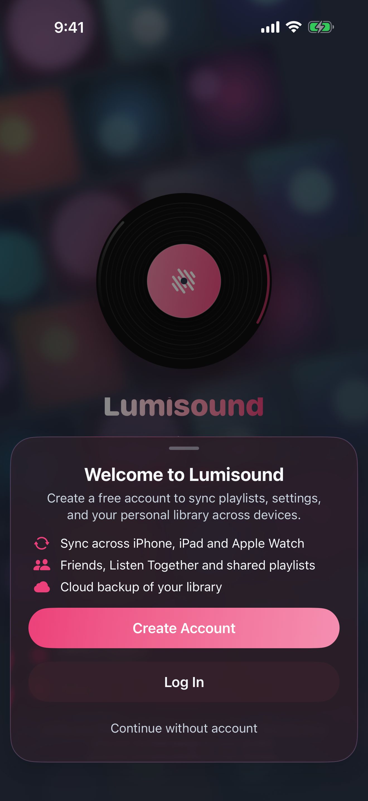
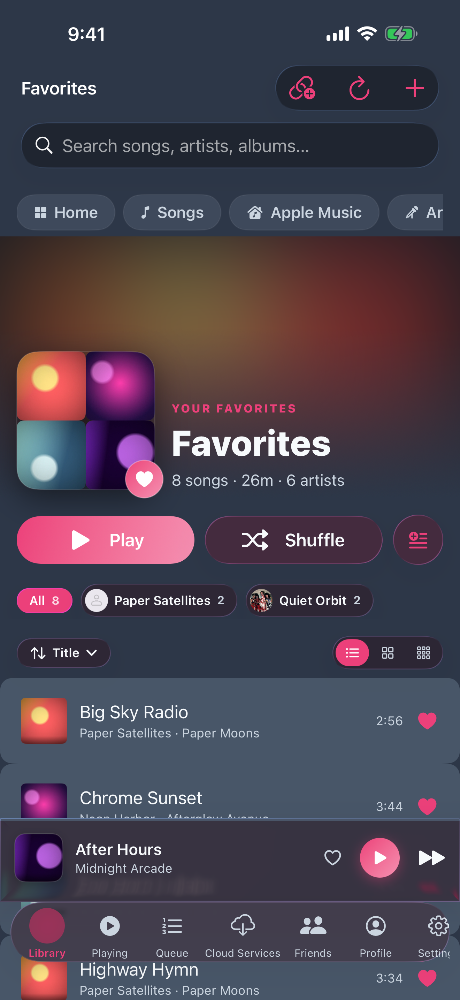
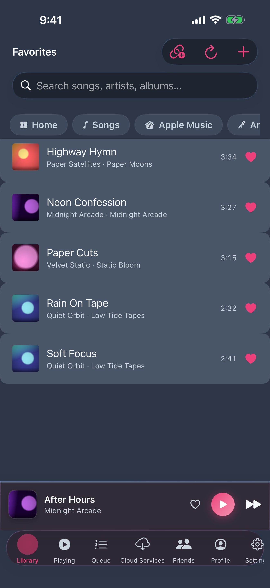
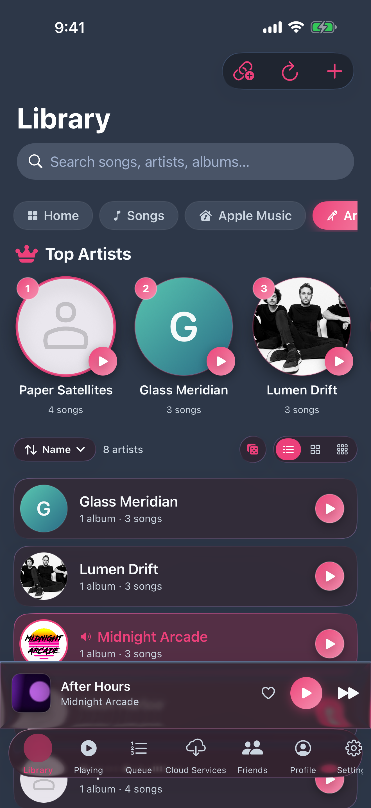
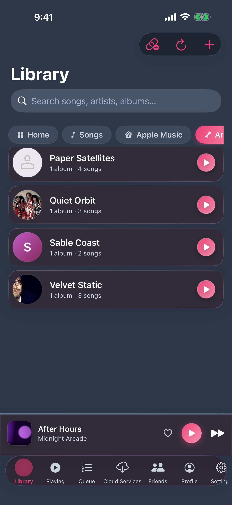
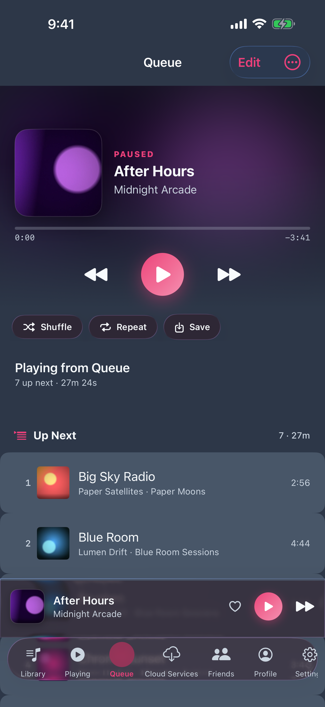
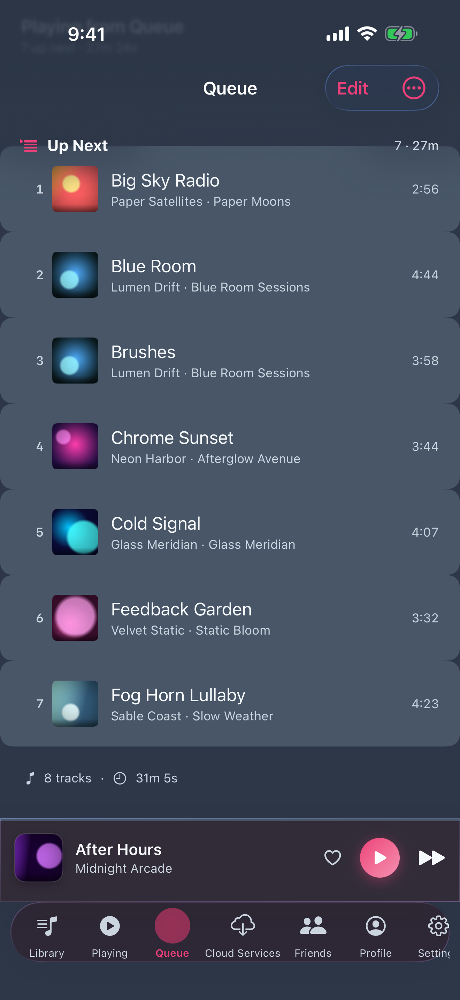
