# Lumisound screenshots

From [this run](https://github.com/HeavenlyXenusVR/Lumisound/actions/runs/36373585046) on `claude/home-page-restructure-m3mxah` at `5660a13`. Replaced on every run.

## iphone-17-pro-max-dark

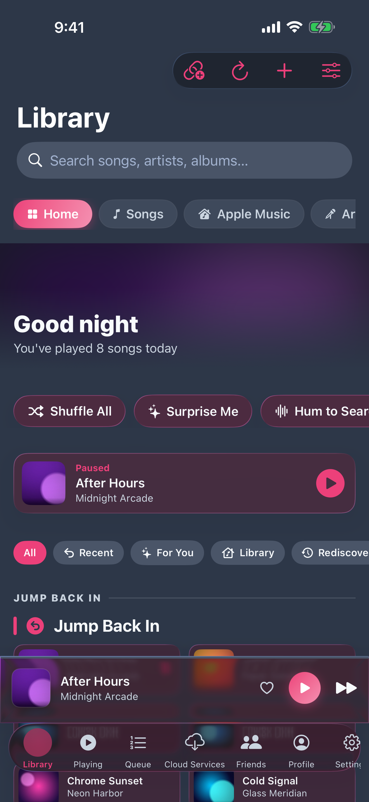
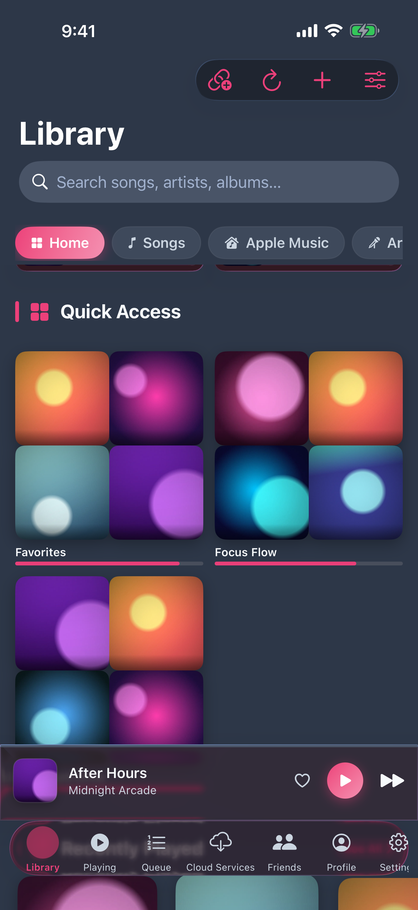
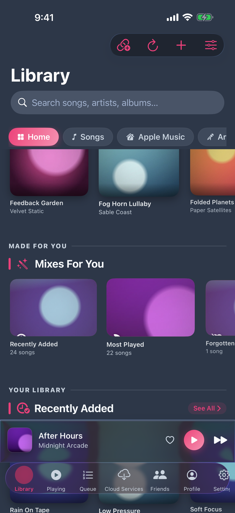
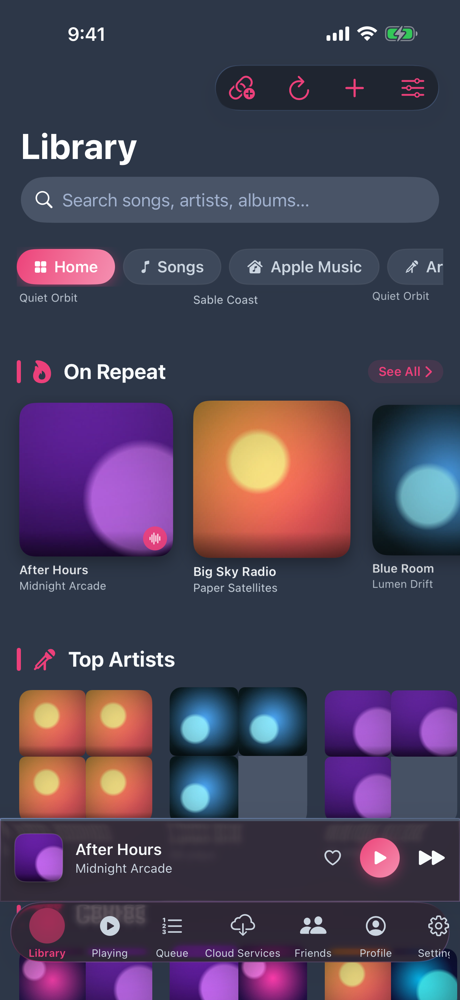
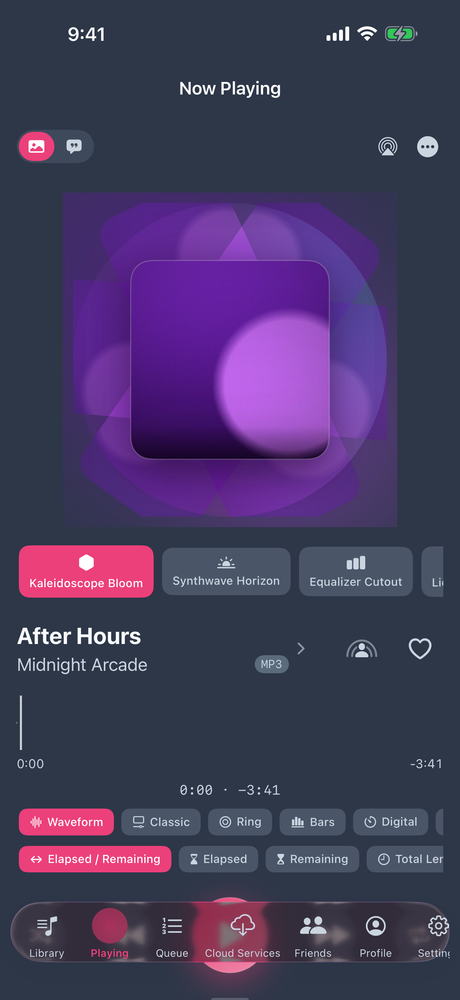
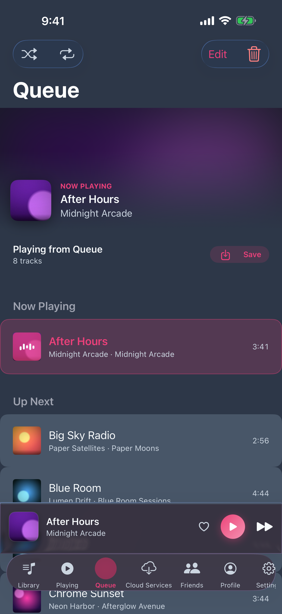
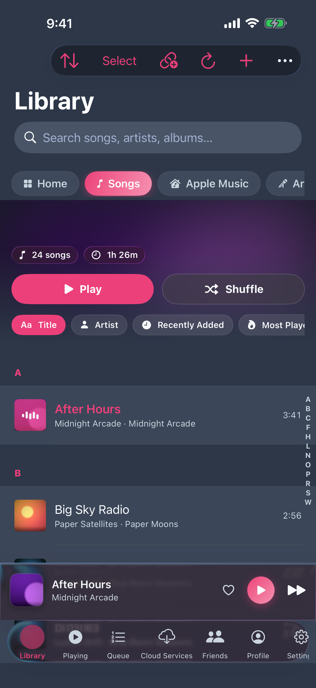
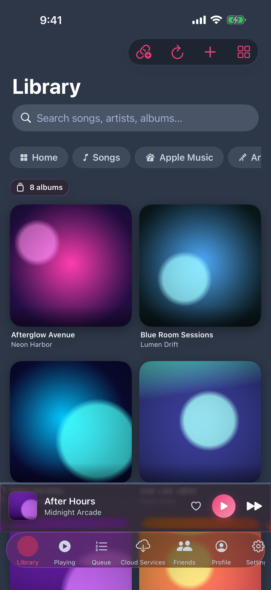
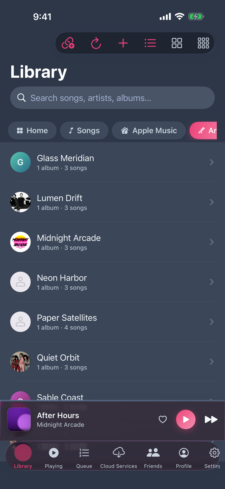
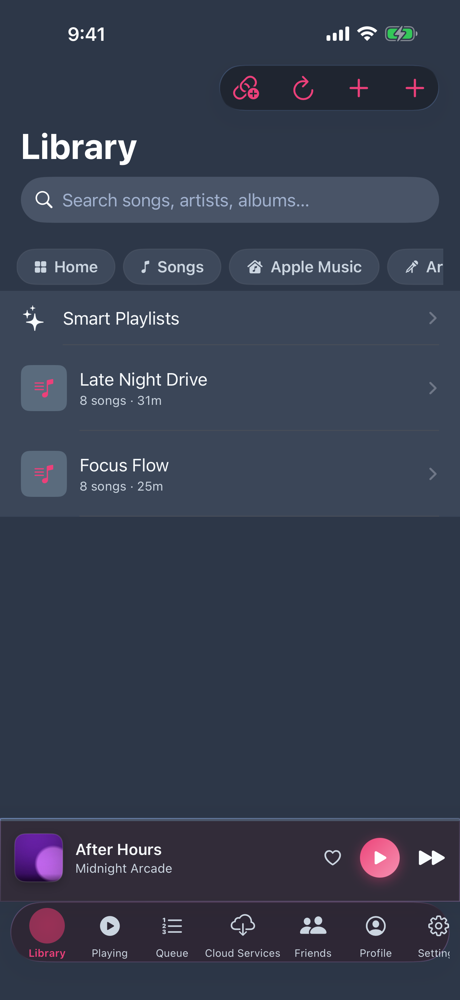
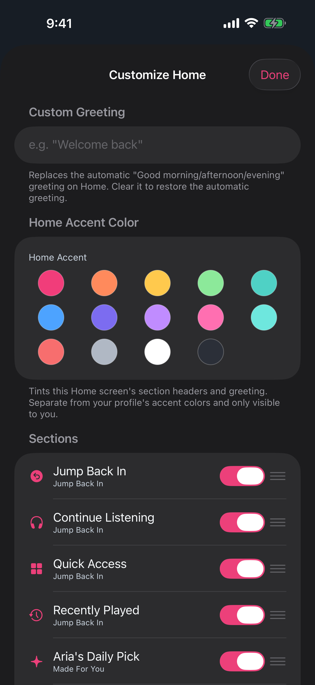
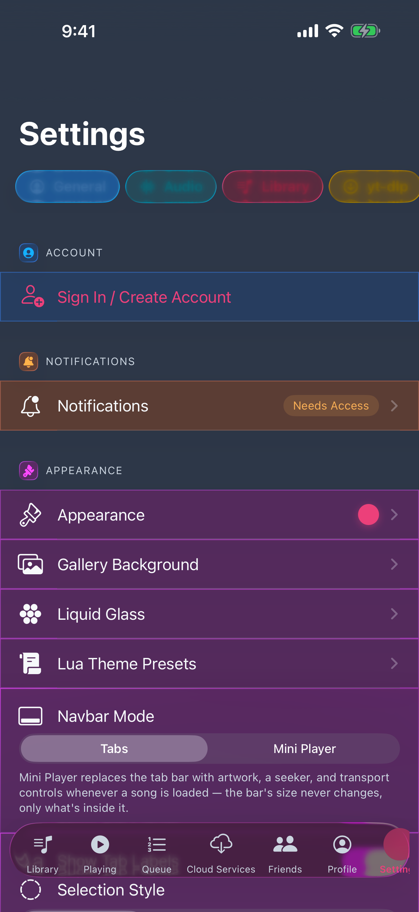
